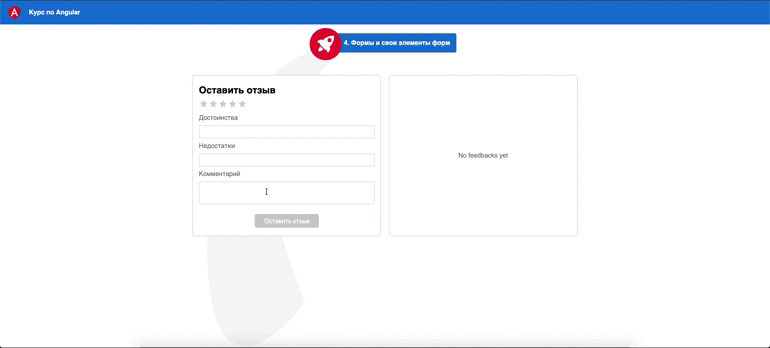

## Формы и свои элементы форм

Вам нужно отобразить форму создания отзывов. Для этого используйте реактивные формы. При этом, за счет взаимодействия компонентов, данные с формы выводите в виде карточек.



Не меняйте структуру html и стили компонетов

Для запуска окружения непрерывной разработки выполните команду

```bash
npm run start:module3
```

Для проверки своего решения выполните

```bash
npm run test:module3
```
